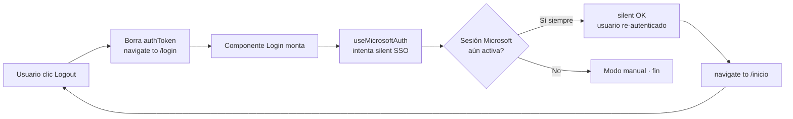

<div align="center">


# 24 · Código Explicado

**Documentación técnica — Aplicativo SEAO**

</div>

---

|                      |                                                                      |
| -------------------- | -------------------------------------------------------------------- |
| **Documento**        | 24 — Código Explicado                                                |
| **Versión**          | 1.0                                                                  |
| **Fecha**            | 14 de julio de 2026                                                  |
| **Depende de**       | 03 · Backend · 04 · Frontend · 05 · Framework · 22 · Convenciones    |
| **Lo usan**          | 17 · Manual del Desarrollador · Onboarding de nuevos desarrolladores |
| **Confidencialidad** | Uso interno                                                          |

---

## 1 · Objetivo

Explicar **las piezas de código no obvias** del sistema — las que un desarrollador nuevo tardaría en entender por sí solo. Se cubren decisiones de diseño sutiles, patrones únicos del proyecto, y trucos técnicos que merecen documentación explícita.

Este documento **no reemplaza al código** — lo comenta. Está pensado para leerse **junto** al código original.

---

## 2 · Framework LAN · el dispatcher del `index.php`

**Archivo:** `repo/index.php`.

### 2.1 La pieza clave — un solo archivo, un solo dispatch

El archivo completo del router del framework LAN cabe en 82 líneas. Es intencionalmente simple. La lógica de despacho es:

```php
$rutas = [
    'listar_motivos'                        => ['MotivosRepo', 'listar'],
    'financiero/recaudos_datos'             => ['RecaudosRepo', 'obtenerRecaudos'],
    'system/database_status_check'          => ['SystemStatusRepo', 'verificarEstadoBaseDatos'],
    // ... 30 acciones en total
];

if (!array_key_exists($accion, $rutas)) {
    Response::error(404, "Endpoint no encontrado");
}

$clase   = $rutas[$accion][0];
$metodo  = $rutas[$accion][1];
$instancia = new $clase();
$resultado = $instancia->$metodo($input);

Response::json(200, ["resultado" => $resultado]);
```

### 2.2 Por qué es interesante

- **`new $clase()` con variable variable** — PHP permite instanciar por nombre. La clase se resuelve dinámicamente del array.
- **`$instancia->$metodo($input)` con variable variable** — igual para el método.
- **Contrato uniforme**: todas las clases se instancian sin argumentos, todos los métodos reciben `$input`.
- **Sin reflexión, sin autoload complejo** — cargar las 18 clases con `require_once` al inicio y despachar por tabla.

Este patrón es un **Command Bus manual** de PHP puro. Sirve como referencia para entender otros routers monolíticos.

### 2.3 Consecuencias del diseño

- **Auditoría trivial:** todas las acciones vivas están en un array de un archivo. Un `grep` sobre `$rutas` da el catálogo completo.
- **No hay descubrimiento automático:** una clase que no esté registrada en `$rutas` **no es accesible**. Elimina la clase de vectores de ataque tipo "endpoint olvidado".
- **Fácil de deprecar:** eliminar una entrada de `$rutas` deja la acción inaccesible sin borrar el código.

---

## 3 · Backend cPanel · `LanClient::post` y la propagación de identidad

**Archivo:** `backend/api/services/LanClient.php`.

### 3.1 La parte no obvia — `X-Usuario-Origen`

```php
public static function post($accion, $params = [], $timeout = null) {
    $payload = array_merge(['accion' => $accion], $params);
    $body = json_encode($payload);

    $headers = [
        'Content-Type: application/json',
        'Authorization: Bearer ' . LAN_API_TOKEN,
        'Content-Length: ' . strlen($body),
    ];

    // ── La parte no obvia ──────────────────
    $user = $GLOBALS['current_user'] ?? null;
    if ($user) {
        $headers[] = 'X-Usuario-Origen: ' . $user['id'] . ' - ' . $user['login'];
    }
    // ──────────────────────────────────────

    // cURL POST con los headers...
}
```

### 3.2 Qué logra este header

**Propaga la identidad del usuario final** desde el backend cPanel hasta el framework LAN, aunque técnicamente la petición sea M2M.

Sin este header, el framework LAN vería todas las peticiones venir del backend cPanel como una única identidad. Con este header, `Logger::write` en el framework LAN identifica al usuario originador y los logs son trazables al usuario.

Esto se ve en `repo/core/logger.php`:

```php
private static function identifyUser() {
    $headers = getallheaders();
    if (!empty($headers['X-Usuario-Origen'])) {
        return $headers['X-Usuario-Origen'];  // "42 - jperez"
    }
    if (!empty($headers['Authorization'])) {
        return 'App Cliente / Servidor Web';  // M2M sin trazabilidad
    }
    return 'Sistema / No autenticado';        // ni auth
}
```

**Es la pieza que hace posible auditar quién consultó qué del ERP.**

---

## 4 · Frontend · `request()` con opciones declarativas

**Archivo:** `frontend/src/utils/http/client.js`.

### 4.1 El problema que resuelve

Antes del refactor, cada llamada al backend duplicaba: construir headers, leer token, parsear response, decidir qué es error, extraer el mensaje del error. Con ~110 endpoints, eso era mucho código repetido.

### 4.2 La solución — un `request()` configurable

```javascript
export async function request(path, options = {}) {
  const {
    method = "POST",
    params,
    body,
    auth = "required", // "required" | "optional" | "none"
    tokenArg,
    requireToken = false,
    contentTypeJson = true,
    accept,
    headers: extraHeaders,
    statusMessages, // { 403: "Sin permiso...", 500: "Error..." }
    check = "success", // "success" | "ok" | "ok+success" | "error-field" | "none"
    messageKeys = ["message", "error", "msg"],
    errorMessage,
    okBeforeParse = false,
    okErrorMessage,
    unwrap = "json", // "json" | "resultado" | "return"
    signal,
    timeoutMs,
  } = options;

  // ... construcción de URL, headers, body ...
  // ... fetch con abort controller ...
  // ... parseo condicional del response ...
  // ... aplicación de la política de check ...
  // ... desempaquetado según unwrap ...
  // ... si algo falla, throw new ApiError(mensaje, status, payload) ...

  return data;
}
```

### 4.3 Por qué merece explicación

**Es declarativo.** El usuario no dice "cómo" leer el response — dice "qué esperas":

- `unwrap: 'json'` → devuelve el JSON entero.
- `unwrap: 'resultado'` → devuelve `payload.resultado` (framework LAN).
- `unwrap: 'return'` → devuelve `payload.data` o payload directo según el patrón.

**Es blindado ante casos raros.** `okBeforeParse: true` verifica `response.ok` **antes** de intentar leer el cuerpo (útil para 5xx que devuelven HTML en vez de JSON).

**Errores tipados.** Cuando algo falla, lanza `ApiError` con `status` y `payload` accesibles — el llamante puede decidir por tipo:

```javascript
try {
  await apiService.getUsuarios();
} catch (err) {
  if (err instanceof ApiError && err.status === 403) {
    // manejo específico
  }
}
```

### 4.4 Consecuencia arquitectónica

Los 110+ endpoints se consumen desde `api.js` con **opciones declarativas**, no con `fetch` directo. Cambiar la política de red global (por ejemplo, añadir un header CSRF a todo el mundo) requiere tocar **un solo archivo**.

---

## 5 · Frontend · `MenuContext` + `useDynamicMenu` (refresh silencioso)

**Archivos:** `frontend/src/contexts/MenuContext.jsx` + `frontend/src/hooks/useDynamicMenu.js`.

### 5.1 El problema

El árbol de menús con permisos granulares es la **fuente de verdad de UX** en el frontend. Se necesita en:

- El sidebar (dibujar los menús).
- Cada componente (verificar `puedeVer`, `puedeCrear`, etc.).
- Guards de rutas.

Si cada componente consultara `get_menu_user.php` por su cuenta, habría **decenas de fetches redundantes**.

### 5.2 La solución

**Un contexto único** que mantiene el árbol en memoria y lo comparte a toda la app. Bajo el capó, un hook (`useDynamicMenu`) que:

1. Al montar, hace fetch al backend.
2. Guarda el árbol en `state`.
3. **Programa un `setInterval` cada 60 s** para refrescar silenciosamente.
4. Al refrescar, **mantiene el árbol previo** mientras el nuevo llega — evita parpadeos.
5. Actualiza el árbol solo cuando el fetch tiene éxito.

### 5.3 Por qué merece explicación

**Es la implementación de "revocación en vivo".** Si un administrador revoca un permiso a un rol, todos los usuarios afectados **pierden el botón "Crear" en la UI en menos de 60 segundos**, sin cerrar sesión.

**Escenario específico:**

- Usuario A está viendo `/configuracion/menus`.
- Administrador cambia `rol_menu.puede_crear = 0` para el rol de Usuario A.
- Dentro de 60 s, `useDynamicMenu` refresca el árbol.
- El árbol nuevo no incluye `puede_crear = 1` para ese menú.
- React re-renderiza el componente.
- El botón "Crear" desaparece **sin que el usuario haga nada**.

Backend paralelamente ya devuelve 403 si el usuario intenta usar el botón (que quizás sigue viendo por unos segundos).

### 5.4 Cuidados en el hook

- **`useRef` para preservar el árbol previo** — evita mostrar árbol vacío durante el fetch.
- **`AbortController` en el fetch** — si el componente se desmonta, no hay `setState` en un componente muerto.
- **`clearInterval` en cleanup** — sin fugas de timers.

Este patrón se puede reutilizar para cualquier "estado global con refresh periódico".

---

## 6 · Frontend · `usePermisos` con dos modos

**Archivo:** `frontend/src/hooks/usePermission.js`.

### 6.1 Firma

```javascript
const {
  permisos, // { ver, crear, editar, eliminar }
  puedeVer,
  puedeCrear,
  puedeEditar,
  puedeEliminar,
  hasAccess,
  loading,
  error,
  ruta,
} = usePermisos(rutaManual, { verificarServidor: false });
```

### 6.2 Los dos modos

**Modo síncrono (default):** lee del árbol ya cargado en `MenuContext`. Cero fetches. Latencia cero.

**Modo autoritativo (`verificarServidor: true`):** hace POST a `/api/middlewares/validate_access.php` con la ruta y empresa. **Verificación en tiempo real contra la BD** — útil para guards estrictos.

### 6.3 Por qué existen dos modos

- **Renderizado condicional** (botones, secciones): el modo síncrono es suficiente. El costo de un botón erróneamente visible es bajo — el backend rechazará la operación.
- **Guards estrictos** (redirigir antes de renderizar): el modo autoritativo evita mostrar UI que el backend luego bloqueará.

### 6.4 Detalle técnico interesante

La ruta se **auto-detecta con `useLocation()`** — el desarrollador rara vez la especifica. Solo si necesita verificar permiso de una ruta distinta (por ejemplo, mostrar un enlace a otra sección solo si el usuario tiene acceso allá) pasa `rutaManual`.

---

## 7 · Backend · `check_permission.php` — la query central

**Archivo:** `backend/api/middlewares/check_permission.php`.

### 7.1 La query que decide

```sql
SELECT
    COALESCE(rm.puede_crear, 0) AS rol_ok,
    COALESCE(cm.puede_crear, 0) AS cargo_ok
FROM menus m
LEFT JOIN rol_menu   rm ON rm.id_menu = m.id AND rm.id_rol   = ?
LEFT JOIN cargo_menu cm ON cm.id_menu = m.id AND cm.id_cargo = ?
WHERE m.ruta = ? AND m.activo = 1
LIMIT 1
```

### 7.2 Por qué es sutil

Tres puntos técnicos:

**1. La columna es dinámica.** El código sustituye `puede_crear` por `puede_ver`, `puede_editar` o `puede_eliminar` según el argumento. **La sustitución es segura** porque el valor sale de un mapa interno (`$columnaAccion = ['ver' => 'puede_ver', ...]`), no del input del cliente. Un desarrollador nuevo podría copiar el patrón sin la validación → deuda documentada.

**2. `LEFT JOIN` con `COALESCE(_, 0)`.** Si no hay fila en `rol_menu` o `cargo_menu` para ese menú, el JOIN devuelve NULL, que se convierte en 0 (denegado). **Es la implementación de "deny by default"** en una sola query.

**3. `LIMIT 1`.** Como `m.ruta` no es unique en el esquema, `LIMIT 1` blinda ante múltiples menús con la misma ruta (deuda menor: `menus.ruta` debería ser UNIQUE).

### 7.3 La decisión final

```php
if ($rol_ok == 1 && $cargo_ok == 1) {
    return;  // autorizado, continúa
}

// denegado
$logger->warning("Acceso denegado por permiso granular", [
    'uid'    => $usuario['id'],
    'rol'    => $usuario['id_rol'],
    'cargo'  => $usuario['id_cargo'],
    'ruta'   => $ruta,
    'accion' => $accion,
]);

http_response_code(403);
echo json_encode(['success' => false, 'message' => 'No tiene permisos...']);
exit;
```

**La política AND** (ambos deben ser 1) se ve directamente en la condición.

---

## 8 · Backend · `Session::create` y `ON DUPLICATE KEY UPDATE`

**Archivo:** `backend/api/models/session.php`.

### 8.1 La operación

```php
public function create($id_usuario) {
    $token = bin2hex(random_bytes(32));
    $expira = date('Y-m-d H:i:s', strtotime('+1 day'));

    $stmt = $this->db->prepare("
        INSERT INTO sesiones (id_usuario, token, fecha_expira)
        VALUES (:id_usuario, :token, :fecha_expira)
        ON DUPLICATE KEY UPDATE
            token = :token_update,
            fecha_expira = :fecha_expira_update
    ");

    $stmt->execute([
        'id_usuario'          => $id_usuario,
        'token'               => $token,
        'fecha_expira'        => $expira,
        'token_update'        => $token,
        'fecha_expira_update' => $expira,
    ]);

    return $token;
}
```

### 8.2 Por qué es clave

La tabla `sesiones` tiene **PK en `id_usuario`** (ver 14 §4). Consecuencia:

- Primer login: `INSERT` funciona, se crea la fila.
- Segundo login del mismo usuario: `INSERT` violaría PK, se activa `ON DUPLICATE KEY UPDATE`, la fila existente se sobrescribe con el nuevo token y expiración.
- **El token del dispositivo previo queda inválido** — la próxima request desde ese dispositivo hará `SELECT` con el token viejo y no encontrará match.

**Es la implementación de "sesión única por usuario" en una operación atómica** — sin necesidad de leer primero, decidir, y escribir.

### 8.3 Detalle interesante

MySQL requiere **placeholders distintos** para el mismo valor si aparece dos veces en el prepared statement. Por eso `token_update` y `fecha_expira_update` — con los mismos valores que `token` y `fecha_expira`.

---

## 9 · Framework LAN · `SystemStatusRepo` y el health check

**Archivo:** `repo/modules/system/status/status_repo.php`.

### 9.1 Decisión no obvia

```php
public function verificarEstadoBaseDatos() {
    try {
        $inicio = microtime(true);
        $db = Database::getInstance();
        Database::setQueryTimeout(3, 'biable01');
        $db->query("SELECT 1");
        $latencia = (microtime(true) - $inicio) * 1000;

        if ($latencia > 3000) {
            $status = 'offline';
        } elseif ($latencia > 800) {
            $status = 'degraded';
        } else {
            $status = 'online';
        }

        return ['status' => $status, 'latencia_ms' => round($latencia)];
    } catch (PDOException $e) {
        return ['status' => 'offline', 'error' => $e->getMessage()];
    }
}
```

### 9.2 Por qué es interesante

**Devuelve HTTP 200 incluso cuando la BD está caída.**

En vez de propagar la excepción (que resultaría en 500 y cortaría al cliente), el método atrapa el error y devuelve `{status: 'offline', error: '...'}` con código 200.

**Motivación:** el dashboard del aplicativo interpreta este JSON directamente. Si el health check devolviera 500, el cliente vería "error de red genérico"; devolviendo 200 con `status: 'offline'`, el cliente puede pintar una bandera roja con el mensaje específico.

**Es un ejemplo de "error semántico" vs "error de transporte":**

- **Transporte:** ¿la petición llegó y volvió? (200 = sí).
- **Semántico:** ¿el sistema está sano? (payload dice que no).

Se usa la misma idea en otros health checks tipo Kubernetes (`liveness` probe siempre devuelve 200 con `body` que indica el estado real).

---

## 10 · Framework LAN · timeouts locales por reporte pesado

**Archivo:** `repo/modules/financiero/recaudos/recaudos_repo.php` y similares.

### 10.1 Patrón observable

```php
public function obtenerRecaudos($parametros) {
    // Elevar límites LOCALES para este método pesado
    ini_set('memory_limit', '2048M');
    ini_set('max_execution_time', 600);
    set_time_limit(600);

    // Asegurar conexión con timeout de statement
    $this->inicializarConexion($parametros);
    Database::setQueryTimeout(600, $this->dbName);

    // Ejecutar consulta pesada
    $stmt = $this->db->prepare("SELECT DISTINCT ON (...) ...");
    // ...
}
```

### 10.2 Por qué es interesante

**No hay configuración global elevada para todos.** El resto del framework opera con límites default de PHP (memory ~256M, timeout ~30 s). Solo los métodos que necesitan más los elevan **localmente**.

Consecuencias:

- Un bug en cualquier módulo del framework **no puede** consumir 2 GB de RAM — solo los métodos autorizados.
- Cada método declara **explícitamente** que sabe que va a ser pesado. Al leer el código, se identifica de inmediato dónde está el costo.

**Es el opuesto al patrón "elevar todo en `php.ini`"** — más disciplinado, más auditable.

---

## 11 · Backend · Detección de conflicto en SSO Microsoft (HTTP 498)

**Archivo:** `backend/api/login_microsoft.php`.

### 11.1 La situación

Al recibir el correo del usuario Microsoft, se hace:

```sql
SELECT id, login, activo FROM usuarios WHERE correo = :correo
```

Y se cuenta el resultado:

```php
$count = $stmt->rowCount();

if ($count === 0) {
    http_response_code(403);
    echo json_encode(['success' => false, 'message' => 'correo no registrado']);
    exit;
}

if ($count > 1) {
    $logger->error("Fallo de seguridad: múltiples usuarios con correo {$correo}");
    http_response_code(498);
    echo json_encode(['success' => false, 'message' => 'conflicto de integridad']);
    exit;
}

// count == 1 → continuar
```

### 11.2 Por qué es notable

**Se elige fallar antes que adivinar.**

Si por error administrativo dos usuarios comparten el mismo correo, el sistema no elige uno al azar (podría dar acceso al usuario incorrecto). En su lugar:

- Devuelve HTTP `498` (código personalizado — el estándar más cercano sería `409 Conflict`).
- Registra un error de alta severidad en logs.
- Le dice al cliente que hay conflicto — sin decir cuál usuario es el problema.

**El operador debe resolver el conflicto en `usuarios` antes de que el SSO pueda funcionar.** Es un fallo ruidoso, no silencioso — que es lo correcto para autenticación.

---

## 12 · Backend · CORS con allow-list explícito

**Archivo:** `backend/api/middlewares/cors.php`.

### 12.1 Implementación

```php
$allowed_origins = [
    'http://localhost:3000',
    'http://localhost:3001',
    'https://aplicativo.supermercadobelalcazar.com',
    'https://proveedor.supermercadobelalcazar.com',
];

$origin = $_SERVER['HTTP_ORIGIN'] ?? '';

if (in_array($origin, $allowed_origins)) {
    header("Access-Control-Allow-Origin: $origin");
    header("Access-Control-Allow-Credentials: true");
} else {
    $logger->warning("CORS Origin rechazado: {$origin}");
    // no se pone header — el navegador bloquea
}

header("Access-Control-Allow-Methods: POST, GET, OPTIONS");
header("Access-Control-Allow-Headers: Content-Type, Authorization");

if ($_SERVER['REQUEST_METHOD'] === 'OPTIONS') {
    http_response_code(200);
    exit;
}
```

### 12.2 Por qué merece atención

**No hay `*` en el header CORS.** El origen se refleja **solo si está en la allow-list**. Consecuencias:

- Sitios de terceros no pueden hacer peticiones autenticadas al aplicativo (el navegador bloquea).
- Un origen no permitido genera un warning log — deja rastro para investigar.
- Preflights `OPTIONS` se atienden con 200 explícito.

**El allow-list incluye `localhost:3000/3001`** — solo para desarrollo. En producción idealmente debería cargarse del `.env` por entorno (deuda documentada en 26).

---

## 13 · Cronjob · validación defensiva del archivo `CHECKER*.TXT`

**Archivos:** `backend/cron/subir_checker_mysql*.php`.

### 13.1 Regla observable

```php
$archivo = __DIR__ . '/../files/lector_precios/CHECKER1.TXT';

if (!file_exists($archivo)) {
    log_error("Archivo no encontrado: $archivo");
    exit(1);
}

if (filesize($archivo) < 1024 * 1024) {  // 1 MB
    log_error("Archivo demasiado pequeño (posiblemente corrupto): " . filesize($archivo));
    exit(1);
}

// Solo si pasa las validaciones, TRUNCATE + INSERT
```

### 13.2 Por qué es defensivo

Si el proceso que sube el archivo (posiblemente FTP desde el ERP) falla a mitad, el archivo puede quedar truncado. Si el cronjob no valida el tamaño mínimo:

- `TRUNCATE checker1` deja la tabla vacía.
- `INSERT` de las pocas filas del archivo truncado deja la tabla con datos parciales.
- **El lector de precios en la sede empieza a mostrar "producto no encontrado" para casi todo** — grave para operación en tienda.

Validando tamaño mínimo antes de tocar la BD, el cronjob **falla ruidosamente** en vez de dejar el sistema en estado inconsistente.

**Es un ejemplo de "fail fast" — mejor errar antes que dejar datos parciales.**

---

## 14 · Frontend · el patrón de exportación a Excel

**Archivo típico:** `components/**/utils/exportarExcel.js` o inline en el hook.

### 14.1 Patrón observable

```javascript
async function exportarRecaudosAExcel(data) {
  // Se hace en el frontend con exceljs — evita transferir volumen extra
  const workbook = new ExcelJS.Workbook();
  const sheet = workbook.addWorksheet("Recaudos");

  // Cabeceras con estilo corporativo
  sheet.getRow(1).values = ["Fecha", "Sede", "Medio", "Monto"];
  sheet.getRow(1).font = { bold: true, color: { argb: "FFFFFFFF" } };
  sheet.getRow(1).fill = {
    type: "pattern",
    pattern: "solid",
    fgColor: { argb: "FF03996B" },
  };
  // 03996B = color corporativo #03996b

  data.forEach((row) => {
    sheet.addRow([row.fecha, row.sede, row.medio, row.monto]);
  });

  // Ancho automático de columnas
  sheet.columns.forEach((c) => (c.width = 20));

  // Descarga
  const buffer = await workbook.xlsx.writeBuffer();
  const blob = new Blob([buffer], {
    type: "application/vnd.openxmlformats-officedocument.spreadsheetml.sheet",
  });
  saveAs(blob, `Recaudos-${fecha}.xlsx`);
}
```

### 14.2 Por qué es sutil

**La generación ocurre en el cliente**, no en el servidor. Consecuencias:

- El servidor solo envía los datos crudos (JSON).
- El navegador construye el `.xlsx` localmente y lo descarga.
- **El servidor no genera un archivo temporal ni consume RAM** para construir el Excel.

**Trade-off:** el cliente hace más trabajo (procesado + memoria). Para reportes con < 100k filas es aceptable; para reportes muy grandes, el patrón se invierte (servidor genera con PhpSpreadsheet + streams a través de ZipStream).

### 14.3 Color corporativo

El estilo corporativo `#03996b` está aplicado en todos los reportes Excel — es la implementación de marca del documento en las descargas.

---

## 15 · Framework LAN · el `.htaccess` que bloquea `.env`

**Archivo:** `repo/.htaccess`.

### 15.1 La regla

```apache
<Files ".env">
  Order Allow,Deny
  Deny from all
</Files>
```

### 15.2 Por qué es crítico

Si el servidor Apache no tuviera esta regla, un atacante podría solicitar `https://api-biable.supermercadobelalcazar.com/.env` y descargar las credenciales de PostgreSQL, el `API_SECRET` y las IPs autorizadas.

**Es la única barrera activa entre `.env` y el mundo.** Su ausencia sería catastrófica.

**Deuda documentada:** la regla actual solo cubre `.env`, no `.env.bak`. Debería ser:

```apache
<FilesMatch "^\.env">
  Order Allow,Deny
  Deny from all
</FilesMatch>
```

Y idealmente, `.env` debería vivir **fuera del docroot** para que ni siquiera Apache pueda servirlo — el `.htaccess` sería una segunda línea de defensa.

---

## 16 · API v1 · `Response` con envelope + `X-Request-ID` (2026-07-17)

**Archivo:** `backend/api/v1/core/Response.php`.

### 16.1 El código

```php
class Response {
    private static function envelope(bool $ok, array $extras): array {
        $requestId = self::currentRequestId();
        header("X-Request-ID: $requestId");
        return array_merge([
            'success' => $ok,
            'meta' => [
                'request_id' => $requestId,
                'timestamp'  => gmdate('c'),
            ],
        ], $extras);
    }

    private static function currentRequestId(): string {
        static $id = null;
        if ($id === null) {
            $id = 'req_' . bin2hex(random_bytes(6));
        }
        return $id;
    }

    public static function ok($data): void {
        header('Content-Type: application/json; charset=utf-8');
        echo json_encode(self::envelope(true, ['data' => $data]));
    }

    public static function error(int $http, string $code, string $msg): void {
        header('Content-Type: application/json; charset=utf-8');
        http_response_code($http);
        echo json_encode(self::envelope(false, [
            'error' => ['code' => $code, 'message' => $msg]
        ]));
    }
}
```

### 16.2 Por qué merece explicación

**Un `X-Request-ID` por vida de request.** El helper `currentRequestId()` usa una variable estática — la primera llamada la genera, las subsiguientes devuelven el mismo valor. Eso permite loguear el mismo ID en múltiples lugares (`Logger::warning`, `RemoteLogger::error`) y correlacionarlo con la respuesta HTTP.

**El ID se propaga por dos canales:**

1. Header HTTP `X-Request-ID` (útil para tooling automatizado del cliente).
2. Body `meta.request_id` (útil cuando el cliente lee JSON).

**Motivación operacional:** cuando un consumidor reporta "recibí un 500 a las 10:47" el equipo puede pedir el `request_id` y hacer `grep` directo en los logs — sin ambigüedad de qué request exactamente.

**No hay tercer estado.** `Response::ok()` y `Response::error()` cubren el espacio completo. No hay `Response::warning()` ni `Response::partial()`. Simplicidad forzada por diseño.

### 16.3 Consecuencia arquitectónica

En las superficies v1, el desarrollador **no puede** producir una respuesta sin envelope estándar aunque quisiera — cualquier `echo` directo violaría el content-type ya establecido y sería visible en QA. La disciplina se impone estructuralmente, no por convención.

---

## 17 · API v1 · Validación de API key con `hash_equals` en tiempo constante (2026-07-17)

**Archivo:** `backend/api/v1/public/auth/apikey.php`.

### 17.1 El código

```php
class ApiKeyAuth {
    public static function authenticate(string $keyPresented): array {
        $hash = hash('sha256', $keyPresented);

        $pdo = Database::pdo();
        $stmt = $pdo->prepare("
            SELECT id, aplicacion, llave, llave_hash, scopes, ips_permitidas, activa
            FROM api_keys
            WHERE activa = 1 AND (llave_hash = :hash OR llave = :key)
            LIMIT 1
        ");
        $stmt->execute(['hash' => $hash, 'key' => $keyPresented]);
        $row = $stmt->fetch(PDO::FETCH_ASSOC);

        if (!$row) {
            self::logDeny('unauthorized', $keyPresented);
            Response::error(401, 'unauthorized', 'API key inválida o inactiva');
            exit;
        }

        // Comparación en tiempo constante contra el hash canónico
        $canonicalHash = $row['llave_hash'] ?: hash('sha256', $row['llave']);
        if (!hash_equals($canonicalHash, $hash)) {
            self::logDeny('unauthorized', $keyPresented);
            Response::error(401, 'unauthorized', 'API key inválida o inactiva');
            exit;
        }

        return $row;
    }

    private static function logDeny(string $code, string $key): void {
        Logger::warning('api_key_denied', [
            'code'        => $code,
            'key_masked'  => self::mask($key),
            'ip'          => $_SERVER['HTTP_X_FORWARDED_FOR'] ?? $_SERVER['REMOTE_ADDR'],
            'request_id'  => Response::currentRequestId(),
        ]);
    }

    private static function mask(string $key): string {
        if (strlen($key) < 12) return '****';
        return substr($key, 0, 4) . '...' . substr($key, -4);
    }
}
```

### 17.2 Por qué es interesante

**Tres decisiones no obvias:**

**1. `hash_equals` en vez de `===`.** Una comparación con `===` cortocircuita en el primer byte distinto — un atacante podría medir microsegundos y adivinar los bytes uno a uno (timing attack). `hash_equals` compara todos los bytes siempre, garantizando tiempo constante independiente del punto de divergencia.

**2. Doble path de autenticación durante migración.** La query busca `llave_hash = :hash OR llave = :key`. Durante la migración de fase 5:

- Keys nuevas se guardan **solo** con hash.
- Keys viejas siguen funcionando via `llave` en plano.
- El código elige el `llave_hash` canónico si existe, o lo calcula al vuelo desde `llave` si no.

Esto permite **rotar sin downtime**: se rehashean gradualmente las keys en producción y la app no rompe.

**3. Un intento fallido no revela la razón.** El log interno diferencia entre "key no existe" y "hash no coincide", pero el cliente siempre recibe el mismo mensaje genérico "API key inválida o inactiva". Impide enumeración por respuesta diferenciada — la misma técnica que se recomendó para `login.php` (DT-016).

### 17.3 Enmascaramiento del log

`mask()` reduce `sk_abcdef123456ghijkl` a `sk_a...jkl` en los logs. Es suficiente para que un operador distinga cuál key falló (los primeros caracteres suelen ser prefijos por tipo) sin exponer el secreto completo en un dump de logs.

---

## 18 · API v1 · Router con tabla enriquecida y validación temprana (2026-07-17)

**Archivo:** `backend/api/v1/public/index.php` (y equivalente en `/private/`).

### 18.1 El código

```php
$routes = [
    'GET /proveedores' => [
        'controller'  => 'ProveedoresController',
        'method'      => 'listar',
        'module'      => 'comercial',
        'http'        => ['GET'],
        'scope'       => 'comercial.proveedores',
    ],
    'GET /proveedores/buscar' => [
        'controller'  => 'ProveedoresController',
        'method'      => 'buscar',
        'module'      => 'comercial',
        'http'        => ['GET'],
        'scope'       => 'comercial.proveedores',
    ],
];

$path   = trim(parse_url($_SERVER['REQUEST_URI'], PHP_URL_PATH), '/');
$path   = preg_replace('#^api/v1/public/#', '', $path);
$httpMethod = $_SERVER['REQUEST_METHOD'];
$key    = "$httpMethod /$path";

// ─── Validación temprana ───
if (!isset($routes[$key])) {
    Response::error(404, 'not_found', "Ruta no encontrada: $key");
    exit;
}

$route = $routes[$key];

// Validación 1 — método HTTP dentro de los permitidos
if (!in_array($httpMethod, $route['http'], true)) {
    Response::error(405, 'method_not_allowed', "Método $httpMethod no permitido");
    exit;
}

// Validación 2 — clase del controlador existe
$controllerClass = $route['controller'];
if (!class_exists($controllerClass)) {
    Logger::error('missing_controller', ['route' => $key, 'class' => $controllerClass]);
    Response::error(500, 'internal_error', 'Configuración de ruta inválida');
    exit;
}

// Validación 3 — método existe
if (!method_exists($controllerClass, $route['method'])) {
    Logger::error('missing_method', ['route' => $key, 'class' => $controllerClass, 'method' => $route['method']]);
    Response::error(500, 'internal_error', 'Handler no implementado');
    exit;
}

// ─── Autenticación + Autorización de scope ───
$apiKey = $_SERVER['HTTP_X_API_KEY'] ?? '';
$keyRow = ApiKeyAuth::authenticate($apiKey);
ApiKeyAuth::authorizeScope($keyRow, $route['scope']);
ApiKeyAuth::checkIp($keyRow);
RateLimit::enforce($keyRow['id'], 30, 60);

// ─── Instanciar y ejecutar ───
$controller = new $controllerClass($keyRow, $route);
$controller->{$route['method']}();
```

### 18.2 Por qué es interesante

**Validación temprana antes de tocar código de negocio.** El router verifica 5 condiciones **en orden estricto** antes de instanciar el controlador:

1. La ruta existe en la tabla.
2. El método HTTP está permitido para esa ruta.
3. La clase del controlador se puede cargar.
4. El método existe en la clase.
5. Autenticación + autorización + rate limit.

Si cualquiera falla, respuesta inmediata con código específico. El controlador **nunca se instancia** con estado inconsistente.

**Errores de configuración se detectan al arranque.** Un typo en el nombre del método (`'listarr'` en vez de `'listar'`) produce un 500 con log detallado — no un fatal error PHP en producción con detalles sensibles filtrados al cliente.

**La tabla es autoritativa.** Añadir un endpoint es un cambio de una línea en la tabla + un método en el controlador. Retirar un endpoint es borrar la entrada — el código del controlador puede quedarse (no se ejecuta).

### 18.3 Diferencia con el router del framework LAN

El framework LAN usa una tabla más simple: `['accion' => ['Clase', 'metodo']]` — dos campos. El router de las superficies v1 usa 5 campos porque necesita: método HTTP, módulo (agrupación), y política de auth (scope o permiso). Es la evolución natural del mismo patrón.

---

## 19 · Frontend · Circuit breaker del Silent SSO (2026-07-24)

**Archivo:** `frontend/src/components/Auth/hooks/useMicrosoftAuth.js`.

### 19.1 El escenario que se está previniendo

Es un bucle infinito no obvio. Sin el circuit breaker, esta secuencia se repetía cada vez que el usuario intentaba desconectarse:



El logout del aplicativo **no invalida la sesión de Microsoft** — solo borra la fila local en `sesiones`. Como Microsoft aún reconoce al usuario, el silent SSO de la nueva `/login` lo devuelve a un estado autenticado inmediatamente. **Al usuario no se le puede desconectar.**

### 19.2 El código

```javascript
export function useMicrosoftAuth() {
  const navigate = useNavigate();
  const location = useLocation();
  const { loginWithToken } = useAuth();
  const [error, setError] = useState(null);

  useEffect(() => {
    // ── Guard 1: bandera explícita de logout reciente ──
    if (sessionStorage.getItem('user_logged_out') === 'true') {
      return; // NO intentar silent
    }

    // ── Guard 2: query string ?logout=true en la URL ──
    // (fallback para casos donde sessionStorage falla, ej. Safari privado)
    const params = new URLSearchParams(location.search);
    if (params.get('logout') === 'true') {
      sessionStorage.setItem('user_logged_out', 'true');
      // Limpia la URL para que no persista
      navigate('/login', { replace: true });
      return;
    }

    // ── Guard 3: circuit breaker por tab ──
    if (sessionStorage.getItem('ms_silent_login_attempted') === 'true') {
      return; // ya se intentó en este tab, no reintentar
    }
    sessionStorage.setItem('ms_silent_login_attempted', 'true');

    // ── Ejecutar silent SSO ──
    performSilentLogin();
  }, []);

  const performSilentLogin = async () => {
    const iframe = document.createElement('iframe');
    iframe.style.display = 'none';
    iframe.src = buildMicrosoftAuthUrl({
      prompt: 'none',
      redirectUri: `${window.location.origin}/silent-callback`,
    });
    document.body.appendChild(iframe);

    // Timeout de seguridad
    const timeout = setTimeout(() => {
      cleanup();
    }, 5000);

    const handler = (event) => {
      if (event.origin !== window.location.origin) return;
      if (event.data?.type === 'silent-login-callback') {
        clearTimeout(timeout);
        cleanup();
        if (event.data.code) {
          exchangeCodeForToken(event.data.code);
        }
      }
    };
    window.addEventListener('message', handler);

    function cleanup() {
      window.removeEventListener('message', handler);
      iframe.remove();
    }
  };

  // Handler que expone el hook para el clic manual
  const startManualLogin = () => {
    sessionStorage.removeItem('user_logged_out');       // resetea el circuit breaker
    sessionStorage.removeItem('ms_silent_login_attempted');
    window.location.href = buildMicrosoftAuthUrl({
      prompt: 'select_account',
      redirectUri: `${window.location.origin}/login/microsoft-callback`,
    });
  };

  return { error, startManualLogin };
}
```

### 19.3 Por qué merece explicación

**Tres capas de guardas, no una.** El diseño no confía en un solo mecanismo:

1. **`user_logged_out`** — bandera semántica. Solo se limpia por acción explícita del usuario (clic en "Iniciar con Microsoft"). Persiste entre navegaciones dentro del mismo tab.
2. **`?logout=true`** en la URL — fallback para navegadores donde `sessionStorage` está deshabilitado o restringido (Safari en modo privado, alguna configuración corporativa restrictiva). El componente lo detecta y setea el flag por su cuenta.
3. **`ms_silent_login_attempted`** — circuit breaker por tab. Impide que un fallo transitorio (ej. iframe timeout, error de red) haga reintentos infinitos en el mismo tab.

**El limpieza es asimétrica.** Setear las banderas es fácil (se hacen en respuesta a eventos). Limpiarlas requiere **una acción intencional del usuario** — el clic en "Iniciar con Microsoft". No hay cleanup automático por tiempo, porque eso volvería a introducir el bucle.

**Ubicación del reset importa.** `startManualLogin` limpia **ambas** banderas antes de redirigir a Microsoft. Si limpiara solo `user_logged_out`, la próxima carga de `/login` pasaría el Guard 1 pero fallaría en Guard 3 al no reintentar.

### 19.4 Comparación con otros circuit breakers del sistema

Este patrón es útil en cualquier escenario donde un flujo automático puede reiniciarse a sí mismo:

| Contexto | Patrón usado |
|---|---|
| Silent SSO (v1.2)         | `sessionStorage` + query param fallback |
| Retry de fetch en `request()` ([04 §9](./04-arquitectura-frontend.md)) | Contador de intentos en el hook |
| Refresh silencioso de `MenuContext` ([05](./05-framework-interno.md) + [24 §5](#5-frontend-menucontext--usedynamicmenu-refresh-silencioso)) | `useRef` para no reintentar mientras hay uno en curso |

Los tres comparten filosofía: **prevenir bucles mediante estado explícito**, no confiar en que "el fallo previo no se repetirá".

---

## 20 · Referencias cruzadas

| Necesitas…                            | Documento                                                     |
| ------------------------------------- | ------------------------------------------------------------- |
| Ver la arquitectura completa          | [02 · Arquitectura General](./02-arquitectura-general.md)     |
| Ver el framework LAN a fondo          | [05 · Framework Interno](./05-framework-interno.md)           |
| Ver el frontend a fondo               | [04 · Arquitectura Frontend](./04-arquitectura-frontend.md)   |
| Ver convenciones formales             | [22 · Convenciones](./22-convenciones.md)                     |
| Guía de desarrollo con estos patrones | [17 · Manual del Desarrollador](./17-manual-desarrollador.md) |
| Análisis de seguridad                 | [12 · Seguridad](./12-seguridad.md)                           |

---

<div align="center">
<sub><b>Supermercados Belalcázar</b> · Documento 24 — Código Explicado · v1.0 · 14 de julio de 2026</sub>
</div>
